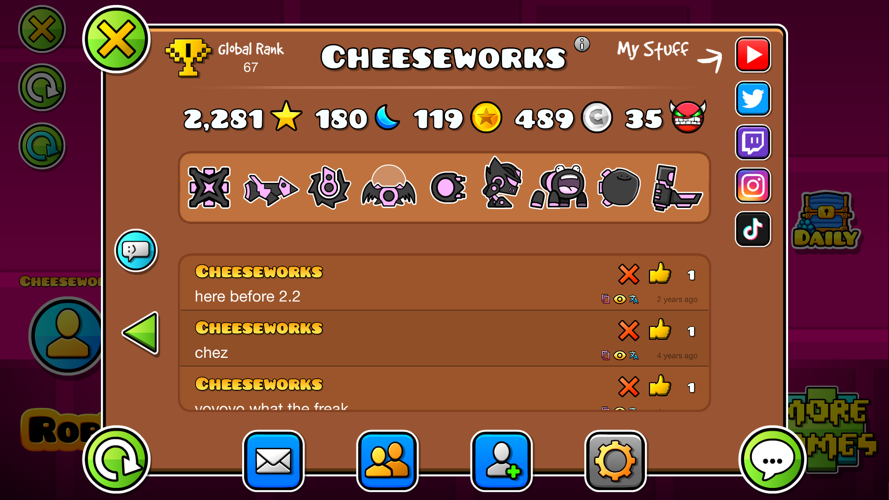

#  Custom Rank
Customize your leaderboard rank!

>   

>  
>  
> 

> [!TIP]
> *This mod has settings you can utilize to customize your experience.*

---

## About
A **purely cosmetic** mod to locally change the "*Global Rank*" field of your account's profile page.

---

### Configuration
In this mod's settings, you can find the options you need to customize the leaderboard rank labels in your profile page. You can change the trophy icon with any of the following options.

- 🏆 **Top 1**
- 🏆 Top 10
- 🏆 Top 50
- 🏆 Top 100
- 🏆 Top 200
- 🏆 Top 500
- 🏆 Top 1,000
- 🏆 Top 5,000
- 🏆 Top 10,000
- 🏆 Top 50,000

🏆 All

> [!TIP]
> *You can find a shortcut to the mod settings in your profile's settings pop-up.*

---

---

### Changelog
###### What's new?!
**[📜 View the latest updates and patches](./changelog.md)**

### Issues
###### What's wrong?!
**[⚠️ Report a problem with the mod](../../issues/)**